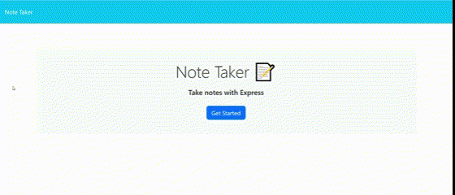

# Note Taker Express

## Description
- An application that is able to write and save notes to be able to organize one's thoughts and keep track of tasks.
- I was hoping to be able to create an application where I could keep track of tasks.
- Whenever I needed to keep track of tasks, this application will help.
- When forgetting tasks, this application will come in handy to help users remember tasks and be able to delete completed tasks.

## Table of Contents
- [Installation](#installation)
- [Usage](#usage)
- [License](#license)
- [Contributing](#contributing)
- [Tests](#tests)
- [Questions](#questions)

## Installation
After pulling up the code, you will fist type 'npm install' in the terminal followed by 'node index.js' which will open the app in your browser.

## Usage

You will be presented with a home page with a "Get Started" button in the middle of the page. After clicking the button, you will be taken to a "notepad" where you can write the note title as well as a descripting for the note. There will be a save icon on the top right after completing the note. after saving, you will be able view your saved note on the left side of the screen. Whenever you are done with the note/task, you can delete the note with the delete icon.

## License

This project is licensed under the [None](https://opensource.org/licenses/None) License - see the [LICENSE](LICENSE) file for details.

## Feature(s)
- A delete button 
- a save button 
- a get started button 
- a text area for notes

## Credits
- [Starter Code](https://github.com/coding-boot-camp/miniature-eureka) 
- [npm js - uuid](https://www.npmjs.com/package/uuid?activeTab=readme) 
- [How to read and write JSON file using node.js](https://www.geeksforgeeks.org/how-to-read-and-write-json-file-using-node-js/) 

## Deployment
[GitHub Repository](https://github.com/Develepor-Dan/Note-Taker)

## Questions
For questions about contribution or about the project, please contact [Daniel Zavala](mailto:zavaladaniel151@gmail.com).